<!-- This file mirrors the root README so GitHub renders the correct project homepage copy. -->

# 🐰 SillyBunny 🐰

An elegant fork of [SillyTavern](https://github.com/SillyTavern/SillyTavern), designed with a cleaner, shell-based UI; Bun-based backend; built-in tutorials, presets, extensions, and a quick-start dashboard; and a lightweight agnetic system to faciliate modern agent functionality.

> [!WARNING]
> This is an in-dev fork, and is considered beta quality. [Please direct all issues to this project's issue tracker.](https://github.com/platberlitz/SillyBunny/issues)
>
> Disclaimer: LLMs are used to facilitate development of this fork. Overall software design, prompting, testing, and documentation are handled by humans. To keep things simple, we try to maintain close to upstream as possible.
---
## At a glance

| | |
|-|-|
| **UI** | Custom navigation shell with search, themes, and mobile layout |
| **Runtime** | Bun (auto-installed), Node.js fallback |
| **Bundled Goodies** | Pre-bundled RP presets, complementary extensions, and additional themes, alongside built-in detailed tutorials |
| **Agents** | Built-in In-Chat Agents for modular RP prompting |
| **Data** | Drop-in compatible with SillyTavern settings, characters, chats, presets, and extensions |
| **Default port** | `4444` |

---

## User Interface

These screenshots show the refreshed `v1.4.0` shell-based UI across Navigate, Customize, Agents, Characters, Search, and a Bunny Guide in-chat view on desktop and mobile.

#### Desktop

| Desktop Navigation Menu | Desktop Customize Menu |
| :---: | :---: |
| 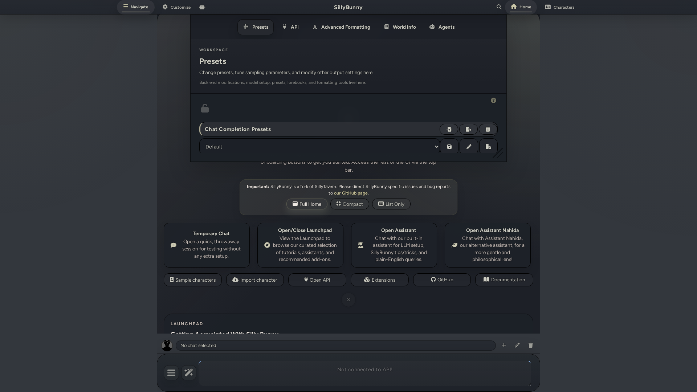 | 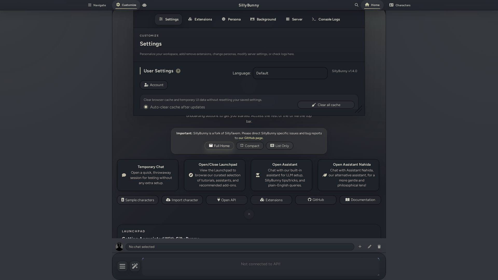 |

| Desktop Agents Menu | Desktop Characters Menu |
| :---: | :---: |
| 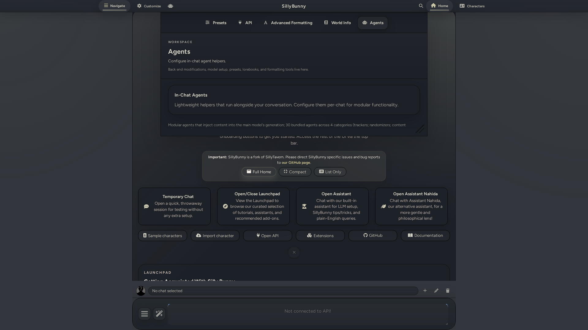 | 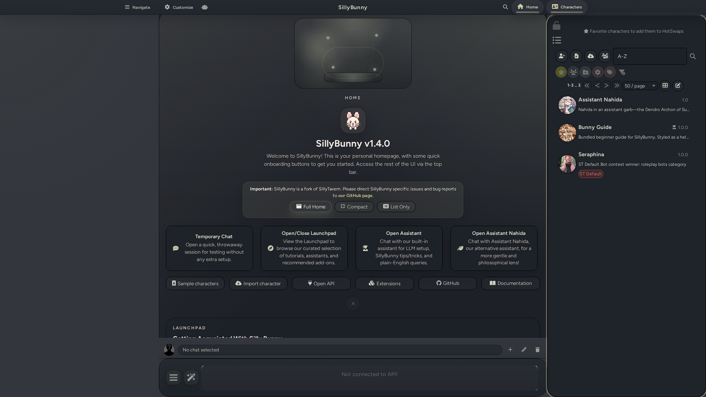 |

| Desktop Search | Desktop Chat |
| :---: | :---: |
| 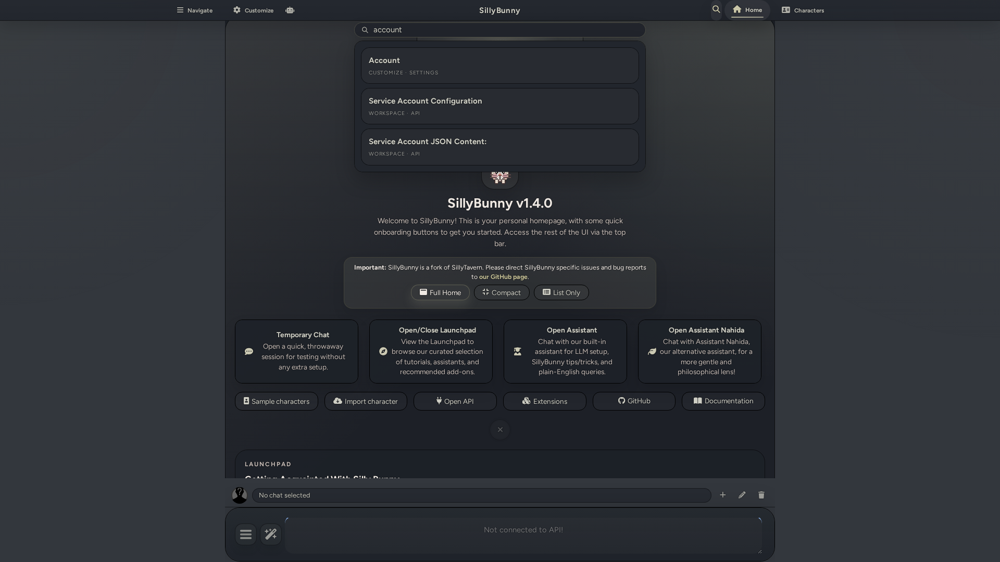 | 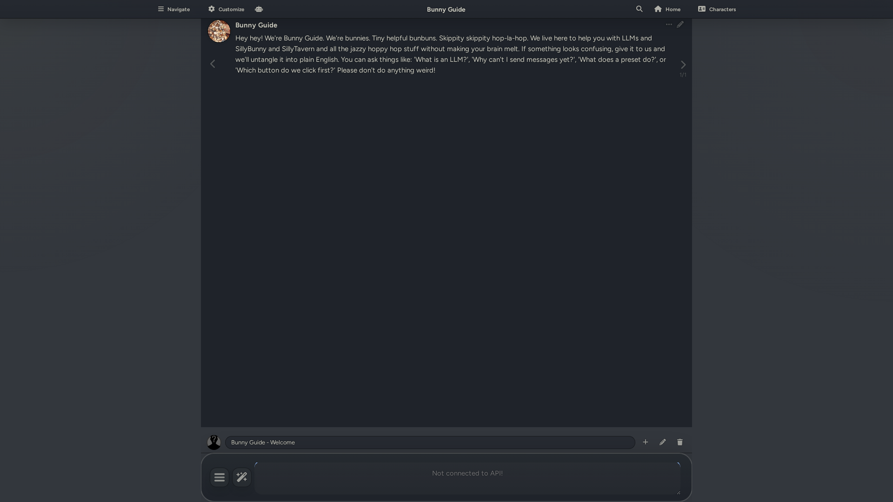 |

#### Mobile

| Mobile Navigation Menu | Mobile Customize Menu | Mobile Agents Menu |
| :---: | :---: | :---: |
| 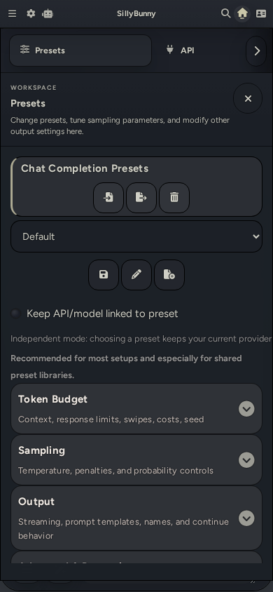 | 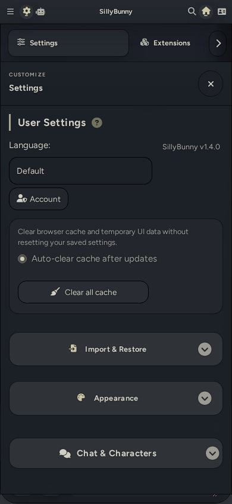 | 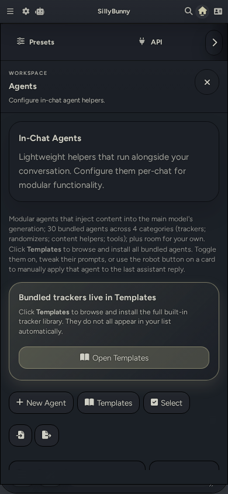 |

| Mobile Characters Menu | Mobile Search | Mobile Chat |
| :---: | :---: | :---: |
| 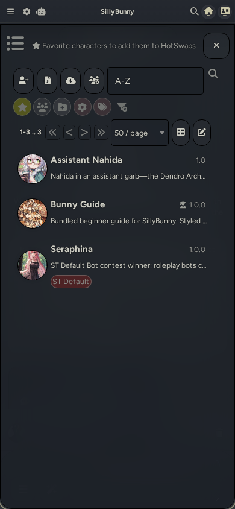 | 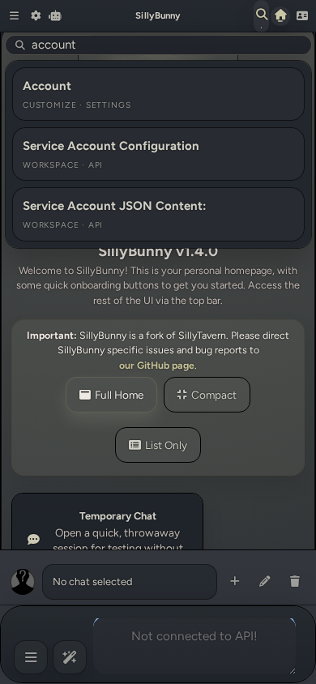 | 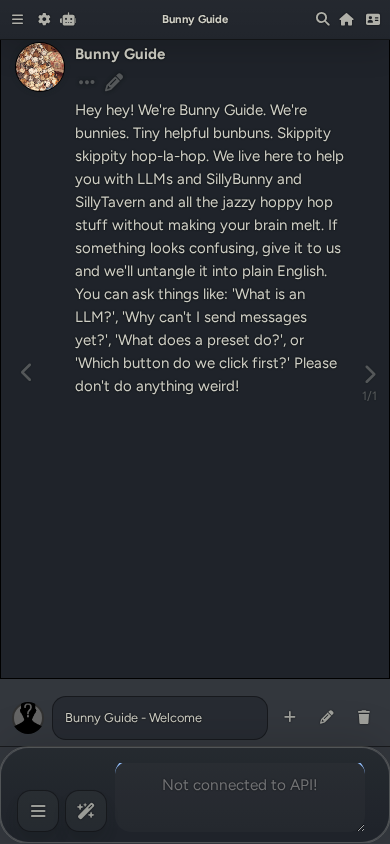 |

---

## Quick Start

[Grab the latest release here.](https://github.com/platberlitz/SillyBunny/releases/latest)

Or run:

```bash
git clone https://github.com/platberlitz/SillyBunny.git
cd SillyBunny
```

Then, run the appropriate launcher for your OS, which auto-installs all dependencies, checks for updates, and starts a server instance. You can also open `http://127.0.0.1:4444` manually in your browser.

| Platform | Command |
|----------|---------|
| Windows | `.\Start.bat` |
| macOS (Terminal) | `./Start.command` |
| macOS (Finder) | Double-click `Start.command` (right-click > Open if Gatekeeper warns) |
| Linux / WSL | `./start.sh` |
| Docker | `docker compose -f docker/docker-compose.yml up --build`
| Android (Termux) | `bash start.sh` |

If you already manage your own Bun install, run via `bun run start`. Other launch variants:

```bash
bun run start:mobile   # lower-memory (--smol)
bun run start:global   # SillyBunny-owned data paths
bun run start:no-csrf  # disable CSRF (local dev)
```

### macOS notes

- If the launcher window closes too fast, run `./Start.command` from Terminal to keep output visible
- If Git is missing, the launcher triggers `xcode-select --install` automatically
- Quarantine metadata from ZIP downloads: `xattr -dr com.apple.quarantine /path/to/SillyBunny`
- Stripped permissions from unzip: `chmod +x Start.command start.sh scripts/*.sh`

### Termux (Android) notes

```bash
pkg update && pkg upgrade -y
pkg install -y git curl unzip
git clone https://github.com/platberlitz/SillyBunny.git
cd SillyBunny
bash start.sh
```

- The launcher defaults to Node.js + npm on native Termux (more reliable than Bun under grun)
- To force Bun anyway: `SILLYBUNNY_TERMUX_RUNTIME=bun bash start.sh`
- For shared storage access: `termux-setup-storage` once before starting

---

### How to Update

| What you want | Command |
|---------------|---------|
| Normal launch (auto-checks for updates) | `./start.sh` |
| Force update then launch | `./start.sh --self-update` |
| Update only, don't start | `./start.sh --self-update-only` |
| Skip update check once | `./start.sh --skip-self-update` |
| Disable auto-update permanently | `SILLYBUNNY_AUTO_UPDATE=0 ./start.sh` |

---

## Changes vs. SillyTavern

### Different UI

The original SillyTavern layout is replaced with a custom, easy-to-navigate graphical shell:

- **Top bar**: Reworked with cleaner, better-defined nested menus. Includes Navigate, Customize, Home, and Characters.
- **Bottom bar**: New bottom bar designed for quick access to persona switching, quick chat switching, and add/edit/remove existing chat functionality.
- **Panel-oriented navigation**: Easy access to all settings in nested panels. Collapsible settings sections in both Chat Completions and Text Completions presets.
- **Global search**: A global search bar that queries across presets, lore, extensions, personas, and settings at once.
- **Platform-aware**: Designed for both desktop and mobile, with a dedicated phone/tablet navigation layer
- **Three modern shell themes**: Modern Glass, Clean Minimal, Bold Stylized
- **Palette customization**: Easily change the accent colour of any theme you're currently using.

### Bun-first runtime

Instead of node.js, this fork uses Bun. This results in consistently faster startups, overall performance, and automatic launcher bootstraping. Node.js is still fully functional as a fallback system.

### In-Chat Agnetic Support

SillyBunny has support for In-Chat Agents. These are custom prompt fields that can run separately from the main generation, which allows for a lot of extra flexibility. Included are several pre-built prompts designed for trackers, post-gen cleanup, anti-slop, and more. Agents can use the main model or a different connection profile, allowing for a fast, smaller model to run long agnetic tasks with ease while a large, main model writes the actual story content.

This feature is currently in beta. These are designed to fill the gap between full extensions and simple, modular agnetic functionality.

**Pipeline:**

1. **Pre-generation agents** injects prompt text before the main reply is generated.
2. **Main Model** writes the main RP reply.
3. **Post-generation agents** optionally rewrites the contents of the main response, or appends extra content after the reply.
4. **Post-process utilities** can extract structured data, run regex cleanup/formatting, or preserve machine-readable blocks while showing cleaner UI.
5. **Groups and templates** let you swap whole stacks quickly without editing your base preset every time.

**Typical Usecases:**

- Trackers for scene, time, items, relationships, off-screen activity, and world state.
- Writing cleanup passes like anti-slop or regex-based formatting.
- Formatting helpers like direction menus, CYOA choices, or NPC profile cards.
- Randomisers and directives that change the pressure, genre, pacing, or escalation of a scene.
- Content toggles for prose style, difficulty, POV, and HTML artifacts.
- Agentic lorebook navigation for on-demand retrieval, memory maintenance, and tree building.
- Cheap helper-model passes that prepare or polish content without spending your main model's budget.

**Included Agents**

* **Trackers:** Achievements, CYOA Choices, Direction Menu, Event, Item, NPC Profiles, Parallel Off-Screen, Relationship, Reputation, Scene, Secrets, Status, Time, and World Detail.
* **Randomizers:** Chaos Mode, Combined Director's Cut, Dead Dove Escalation, Genre, Grounded Complication, Intimacy & Kink, Scene Driving Force, and Scene Pressure Cocktail.
* **Content:** Difficulty Increase, Don't Write for User, Friction Mode, Grounded Prose, HTML Toggle, and Write for User.
* **Post Generation Editors:** Prose Polisher
* **Additional Agents:** Pathfinder (an agentic lorebook navigator with 8 tools for retrieval, memory maintenance, and tree building).

**Agent Behaviors and Settings**
* Agentic prompts feature inline run-order editing, click-to-edit functionality, and fullscreen prompt editors.
* Agents use the main connection profile by default with an 8192 max token limit. Separate connection profile support is available when explicitly selected.
* Bundled trackers, including CYOA Choices, are configured for pre-generation. The main model emits clickable options directly in the response.
* All bundled tracker and menu agents default to the User injection role to maintain compatibility with models that deprioritize System injections.
* Built-in groups are available for the full preset, trackers only, and randomizers only.
* Custom agents support ST-style regex options.

### Bundled Goodies & Tutorials
SillyBunny includes some extras by default to help you get started right away:
* A tutorial that guides you through the SillyBunny interface.
* Pre-bundled roleplay presets from purachina and Geechan.
* A character card conversion preset from TLD to help you generate character cards from scratch, or convert from existing cards to a better format.
* A friendly quick-start guide with optional recommended extensions (Summary Sharder, Dialogue Colours, Quick Image Gen, Guided Generations, CSS Snippets).
* Two custom assistants to help you get started - Bunny Guide, and Assistant Nahida.

---

## Latest Update

### v1.4.0 (2026-04-22)

**Added**

- A universal search flow for the shell, with Search available as a quick shortcut and shared results across Navigate and Customize.
- A fuller home/launchpad experience, including persistent `Full Home`, `Compact`, and `List only` modes, bundled helpers, and launchpad shortcuts for common actions.
- New UI customization tools, including a Google Font picker, accent color presets, and a custom RGB accent option.
- More built-in agnetic and reasoning support, including visible reasoning-tag presets, extra Custom OpenAI-compatible reasoning presets, an agent cancel action, agent diff/history viewing, and Pathfinder auto-use for attached lorebooks.
- Additional context-size presets and a server-admin branch switcher.

**Removed or Changed**

- Replaced the old per-panel settings search bars with a single universal search surface under the SillyBunny header.
- Changed the default visual stack to the `Dark V1.0` UI theme with the `Clean Minimal` shell style.
- Removed the Forest Dusk, Forest Dawn, and Rose Glow theme preset buttons.
- Reworked the welcome/home surface so it opens correctly on fresh installs, keeps its controls visible across modes, and uses a cleaner launchpad/bundled-extras layout.
- Refreshed the `v1.4.0` README screenshot gallery and removed the stale screenshot automation/docs flow that no longer matched the live shell.

**Fixed**

- Termux/Android text replacement and autocomplete behavior, so accepted keyboard corrections no longer append broken text in the send box.
- Mobile layout and parity issues across checkboxes, toggles, prompt/settings rows, menu spacing, and shared control alignment.
- Theme/font regressions, including self-hosted Figtree fallback behavior, legacy theme font aliases, stale brown shell colors, and Moonlit Echoes CSS/layout persistence issues.
- Shell/navigation issues affecting launchpad toggling, Home active state/highlighting, Navigate/Customize switching, quick shortcuts, and welcome-panel sizing/reflow.
- Pathfinder stability issues around saved settings rehydration, connection-profile selection, lorebook tree rebuilding, popup scrolling, and noisy diagnostics.
- Reasoning/provider compatibility bugs affecting startup, token counters, OpenAI/Gemini response parsing, Gemini thought signatures, and visible reasoning controls.
- Agent and message-tooling bugs affecting running toasts, post-processing visibility, structured-content handling, and message metadata sync.
- Bottom-bar and persona behavior, including startup loading, chat switching, and persona selection when duplicate names exist.
- Extension/runtime issues including duplicate extension cards, stale disabled-extension entries, minimum-version compatibility, reinstall flow, and ARM/Node update churn in `package-lock.json`.
- Readability and maintenance issues, including flattened AI Studio/terminal debug logging and lint/async helper cleanup needed to keep the codebase green.

[Find other changelogs in our Releases.](https://github.com/platberlitz/SillyBunny/releases)

---

## Upstream Information

SillyBunny is a fork of SillyTavern. Most SillyTavern behavior, data formats, and ecosystem knowledge still apply. If running into an issue reproducable in upstream, please direct issues there.

| Resource | Link |
|----------|------|
| Upstream repo | [SillyTavern/SillyTavern](https://github.com/SillyTavern/SillyTavern) |
| Upstream docs | [docs.sillytavern.app](https://docs.sillytavern.app/) |
| Discord | [discord.gg/sillytavern](https://discord.gg/sillytavern) |
| Subreddit | [r/SillyTavernAI](https://reddit.com/r/SillyTavernAI) |

If something feels off, compare against the upstream `release` branch first.

## Contributors

- [Platberlitz](https://github.com/platberlitz)
- [Geechan](https://github.com/Geechan)

[Licensed as free software under the AGPL-3.0.](https://www.gnu.org/licenses/agpl-3.0.en.html)
